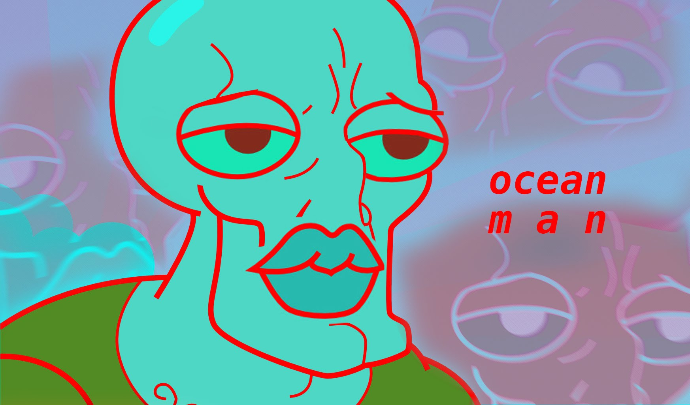

% Assignment 5
% Ridge Hamre
% July 31st, 2017

# 1st slide
<aside class="notes">
The song is Ocean Man by Ween from the Spongebob Squarepants Movie
</aside>
Ocean Man
<figure>
					
					<figcaption>OceanMan</figcaption>
				</figure>

# Slide 2
Take me by the Hand
<figure>
					
					<figcaption>Bit</figcaption>
				</figure>
        
# Slide 3
Lead me to the land
<figure>
					
					<figcaption>TakeMeTo</figcaption>
				</figure>
        
# Slide 4
that you understand
<figure>
					
					<figcaption>Land</figcaption>
				</figure>
        
# Slide 5
Ocean Man
<figure>
					
					<figcaption>Squidward</figcaption>
				</figure>
        
# Slide 6
The voyage to the corner of the globe is a real trip
<figure>
					
					<figcaption>Globe</figcaption>
				</figure>
        
# slide 7
Ocean Man
<figure>
					
					<figcaption>Squidward</figcaption>
				</figure>
        
# slide 8
The curst of a tan man emibed by the sand
<figure>
					
					<figcaption>TanTrump</figcaption>
				</figure>
        
# slide 9
Soaking up the thirst of the land
<figure>
					
					<figcaption>Straw</figcaption>
				</figure>
        
# slide 10
Ocean Man
<figure>
					
					<figcaption>Squidward</figcaption>
				</figure>
        
# slide 11
Can you see through the wonder of amazement at the oberman

# slide 12
Ocean Man
<figure>
					
					<figcaption>Squidward</figcaption>
				</figure>
        
# slide 13
The crust is eluzive when it casts forth to the childlike man
<figure>
					
					<figcaption>ManChild</figcaption>
				</figure>
        
# slide 14
Ocean Man
<figure>
					
					<figcaption>Squidward</figcaption>
				</figure>
        
# slide 15
The sequence of a life form braised in the sand
<figure>
					<figcaption>beach</figcaption>
				</figure>
        
# slide 16
Soaking up the thirst of the land
<figure>
					
					<figcaption>Straw</figcaption>
				</figure>
        
# slide 17
Ocean Man

# slide 18
Ocean Man

# slide 19
Ocean Man

# slide 20
Ocean Man
<figure>
					
					<figcaption>Squidward</figcaption>
				</figure>
        
# slide 21
Take me by the Hand
<figure>
					<figcaption>LeadingHand</figcaption>
				</figure>
        
# slide 22
Lead me to the land
<figure>
					
					<figcaption>Roadswim</figcaption>
				</figure>
        
# slide 23
that you understand

# slide 24
Ocean Man
<figure>
					
					<figcaption>Squidward</figcaption>
				</figure>
        
# slide 25
The voyage to the corner of the globe is a real trip

					<figcaption>Globe</figcaption>
				</figure>
        
# slide 26
Ocean Man
<figure>
					
					<figcaption>Squidward</figcaption>
				</figure>
        
# slide 27
The curst of a tan man emibed by the sand
<figure>
					
					<figcaption>TanTrump</figcaption>
				</figure>
        
# slide 28
Soaking up the thirst of the land
<figure>
					
					<figcaption>Straw</figcaption>
				</figure>
        
# slide 29
Ocean Man
<figure>
					
					<figcaption>Squidward</figcaption>
				</figure>
        
# slide 30
Can you see through the wonder of amazement at the oberman

# slide 31
Ocean Man
<figure>
					
					<figcaption>Squidward</figcaption>
				</figure>
        
# slide 32
The crust is eluzive when it casts forth to the childlike man
<figure>
					
					<figcaption>ManChild</figcaption>
				</figure>
        
# slide 33
Ocean Man
<figure>
					
					<figcaption>Squidward</figcaption>
				</figure>
        
# slide 34
The sequence of a life form braised in the sand
<figure><figcaption>beach</figcaption></figure>

# slide 35
Soaking up the thirst of the land

