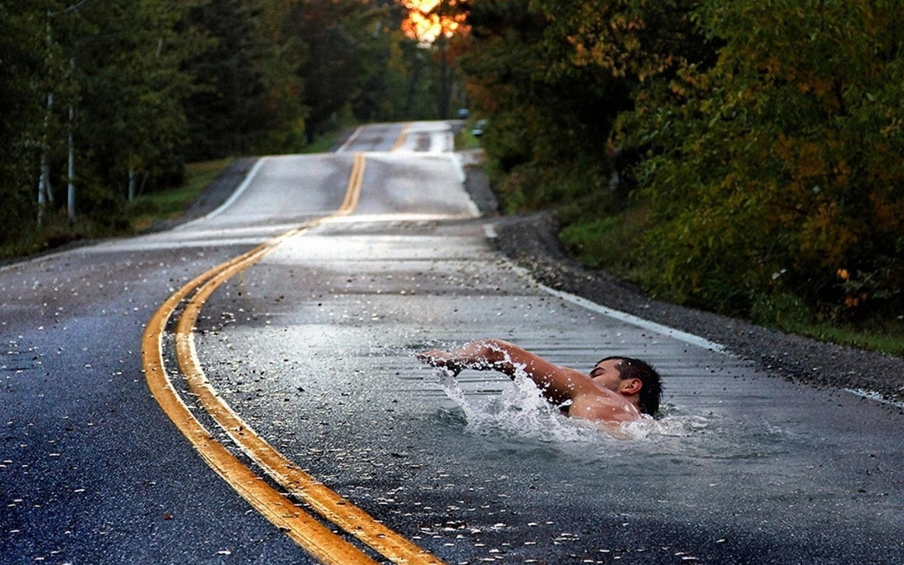

% Assignment 5
% Ridge Hamre
% July 31st, 2017

# Ocean Man
<aside class="notes">
The song is Ocean Man by Ween from the Spongebob Squarepants Movie
</aside>
<figure>
					
					<figcaption>OceanMan</figcaption>
				</figure>

# 
<aside class="notes">
Take me by the Hand
</aside>
<figure>
					
					<figcaption>Bit</figcaption>
				</figure>
        
# Lead me to the land
<aside class="notes">Lead me to the land</aside>
<figure>
					
					<figcaption>TakeMeTo</figcaption>
				</figure>
        
# That you understand
<aside class="notes">that you understand</aside>
<figure>
					
					<figcaption>Land</figcaption>
				</figure>
        
# Ocean Man
<aside class="notes">Ocean Man</aside>
<figure>
					
					<figcaption>Squidward</figcaption>
				</figure>
        
# 
<aside class="notes">The voyage to the corner of the globe is a real trip</aside>

The voyage to the corner of the globe is a real trip

<figure>
					
					<figcaption>Globe</figcaption>
				</figure>

# Ocean Man
<aside class="notes">Ocean Man</aside>
<figure>
					
					<figcaption>Squidward</figcaption>
				</figure>
        
# 
<aside class="notes">The crust of a tan man emibed by the sand</aside>
<figure>
					
					<figcaption>TanTrump</figcaption>
				</figure>
        
# Soaking up the thirst of the land
<aside class="notes">Soaking up the thirst of the land</aside>
<figure>
					
					<figcaption>Straw</figcaption>
				</figure>
        
# Ocean Man
<aside class="notes">Ocean Man</aside>
<figure>
					
					<figcaption>Squidward</figcaption>
				</figure>
        
# Can you see through the wonder of amazement at the oberman
<aside class="notes">Can you see through the wonder of amazement at the oberman</aside>

# Ocean Man
<aside class="notes">Ocean Man</aside>
<figure>
					
					<figcaption>Squidward</figcaption>
				</figure>

# The crust is elusive when it casts forth
<aside class="notes"> The crust is elusive when it casts forth</aside>
<figure>
					
					<figcaption>crust</figcaption>
				</figure>

# To the childlike man
<aside class="notes">To the childlike man</aside>
<figure>
					
					<figcaption>ManChild</figcaption>
				</figure>
        
# Ocean Man
<aside class="notes">Ocean Man</aside>
<figure>
					
					<figcaption>Squidward</figcaption>
				</figure>
        
# The sequence of a life form braised in the sand
<aside class="notes">The sequence of a life form braised in the sand</aside>
<figure>
					<figcaption>beach</figcaption>
				</figure>
        
# Soaking up the thirst of the land
<aside class="notes">Soaking up the thirst of the land</aside>
<figure>
					
					<figcaption>Straw</figcaption>
				</figure>
        
# Ocean Man
<aside class="notes">Ocean Man</aside>
<figure>
					
					<figcaption>guitar solo</figcaption>
				</figure>
        
# Ocean Man
<aside class="notes">Ocean Man</aside>
<section data-background-video="images/cop.webm" data-background-video-loop>
</section>

# Ocean Man
<aside class="notes">Ocean Man</aside>
<section data-background-video="images/kangaroo.webm" data-background-video-loop>
</section>

# Ocean Man
<aside class="notes">Ocean Man</aside>
<figure>
					
					<figcaption>Squidward</figcaption>
				</figure>
        
# Take me by the Hand
<aside class="notes">Take me by the Hand</aside>
<figure>
					<figcaption>LeadingHand</figcaption>
				</figure>
        
# Lead me to the land
<aside class="notes">Lead me to the land</aside>
<figure>
					
					<figcaption>Roadswim</figcaption>
				</figure>
        
# That you understand
<aside class="notes">that you understand</aside>

# Ocean Man
<aside class="notes">Ocean Man</aside>
<figure>
					
					<figcaption>Squidward</figcaption>
				</figure>
        
# The voyage to the corner of the globe is a real trip
<aside class="notes">The voyage to the corner of the globe is a real trip</aside>
<figure>
					
					<figcaption>Globe</figcaption>
				</figure>
        
# Ocean Man
<aside class="notes">Ocean Man</aside>
<figure>
					
					<figcaption>Squidward</figcaption>
				</figure>
        
# The crust of a tan man emibed by the sand
<aside class="notes">The crust of a tan man emibed by the sand</aside>
<figure>
					
					<figcaption>TanTrump</figcaption>
				</figure>
        
# Soaking up the thirst of the land
<aside class="notes">Soaking up the thirst of the land</aside>
<figure>
					
					<figcaption>Straw</figcaption>
				</figure>
        
# Ocean Man
<aside class="notes">Ocean Man</aside>
<figure>
					
					<figcaption>Squidward</figcaption>
				</figure>
        
# Can you see through the wonder of amazement at the oberman
<aside class="notes">Can you see through the wonder of amazement at the oberman</aside>

# Ocean Man
<aside class="notes">Ocean Man</aside>
<figure>
					
					<figcaption>Squidward</figcaption>
				</figure>
				
# The crust is elusive when it casts forth
<aside class="notes"> The crust is elusive when it casts forth</aside>
<figure>
					
					<figcaption>crust</figcaption>
				</figure>

# To the childlike man
<aside class="notes">To the childlike man</aside>
<figure>
					
					<figcaption>ManChild</figcaption>
				</figure>        
        
# Ocean Man
<aside class="notes">Ocean Man</aside>
<figure>
					
					<figcaption>Squidward</figcaption>
				</figure>
        
# The sequence of a life form braised in the sand
<aside class="notes">The sequence of a life form braised in the sand</aside>
<figure><figcaption>beach</figcaption></figure>

# Soaking up the thirst of the land
<aside class="notes">Soaking up the thirst of the land</aside>

